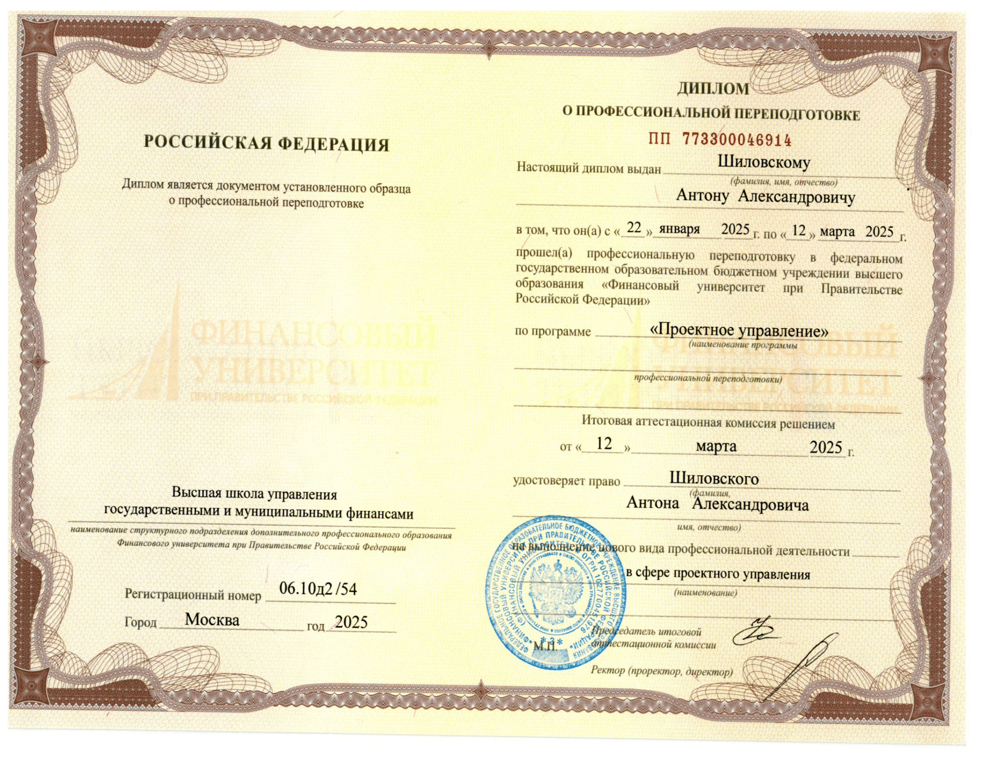
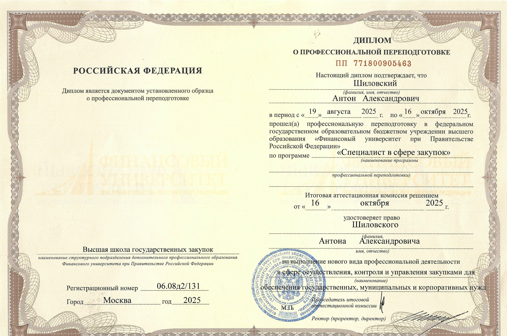
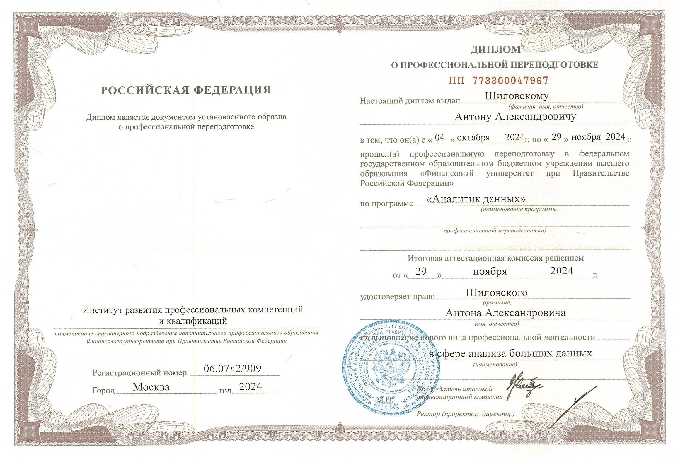

# Бизнес-аналитик. Преподаватель. Исследователь с фокусом на бизнес-выгоды.

---

## Навигация {#навигация}
— [Общее](#общее) • 
— [Опыт](#опыт) • 
— [Основное образование](#образование) • 
— [Дополнительное образование](#дополнительное-образование) • 
— [Навыки](#навыки) • 
— [Сообщества](#профессиональные-сообщества) • 
— [О себе](#о-себе) • 
— [Задачи](https://shilovskyanton.ru/tasks/) • 
— [Портфолио](https://shilovskyanton.ru/portfolio/) •

---

## Общее {#общее}
**Местоположение:** Москва, Россия  
**Возраст:** 29 лет  
**Опыт работы:** 8 лет

**Проекты:**  
[GitHub](https://github.com/antonshilovsky) | [Хабр](https://habr.com/ru/users/ShilovskyAnton/articles/)

---

## Опыт {#опыт}

### АО «АВК» — Бизнес-аналитик (март 2024 — наст. время)
- Проверка новых контрагентов и формализация условий сотрудничества.  
- Разработка и внедрение BI-решения *под ключ* на основе СУБД и Power BI.  
- Создание и поддержка API-интеграции с внешними источником, загрузка данных в СУБД.  
- Построение дашбордов в BI-системах.
- Онбординг сотрудников.

**Результат:** внедрены корпоративный центр обучения и курс для онбординга, корпоративное решение для скоринговой оценки контрагентов (3000+ наблюдений).

---

### ИТ-РТК — Эксперт программы SQL-разработчик (апрель 2025 — наст. время)
Разработка и проведение учебных программ повышения квалификации:

1. **«SQL-разработчик»** — 144 академических ч.  
   (12 ч лекций, 68 ч лабораторных, 64 ч практических)

2. **«Управление ИТ-проектами»** — 72 академических ч.  
   (14 ч лекций, 29 ч практических, 29 ч СРС)

**Результат:**  Начитка и сопровождение учебного контента — 440 академических часов, 600 слушателей.

---

### Электронное издательство „Юрайт“ — Ведущий редактор (2020 — 2024)
- Руководство рабочей группой (Jira, Confluence), контроль качества контента.  
- Разработка методики создания цифровых курсов для ведущих вузов (Финуниверситет, ВШЭ, МГИМО).  
- Аналитика образовательного рынка и формализация ТЗ.  
**Результат:** рост посещаемости сайта +50 тыс. в год, обучение ок. 200 тыс. студентов и 10 сотрудников.

---

### НИУ ВШЭ — Аналитик (2019)
- Поддержка терминалов Bloomberg, сопровождение договоров и аналитика данных.  
- Координация работы преподавателей и ведение сайта Школы финансов.  

---

### Цифра Брокер — Инвестиционный консультант (2017 — 2018)
- Управление 11 инвестиционными портфелями (суммарно $180 000).  
- Опыт трейдинга на NYSE и NASDAQ.  

---

## Образование {#образование}

- **Финансовый университет при Правительстве РФ** (2023 — 2025)  
  *Информационные технологии и анализ больших данных (диплом с отличием)*  
  Тема магистерской: [Автоматизация скоринга контрагентов и визуализация данных представителя среднего бизнеса](https://ppt-online.org/1639955)
  — специализация: управление ИТ в цифровой экономике  

- **НИУ ВШЭ** (2018 — 2019)  
  *Strategic Corporate Finance / Корпоративные финансы*

---

## Дополнительное образование {#дополнительное-образование}

- **Финансовый университет при Правительстве РФ** — *Управление проектами* (2025)  
  > Управление проектами
  
  
- **Финансовый университет при Правительстве РФ** — *Инжиниринг данных* (2025)  
  > SQL, PostgreSQL, Python, Базы данных
  
  
 - **Финансовый университет при Правительстве РФ** — *Специалист в сфере закупок* (2025)  
  > Управление проектами, ГОСТ, Взаимодействие с государственными органами
  
  
- **Финансовый университет при Правительстве РФ** — *Аналитик данных* (2024)  
  > SQL, Python, BI  
  

- **Финансовый университет при Правительстве РФ** — *Системный администратор (базовый курс)* (2023)  
  

---

## Навыки {#навыки}

**Технические:**  
Power BI, SQL, Python, REST API, MS Access, VBA, Docker, WSL, Windows Server  

**Методические:**  
Обучение сотрудников, проведение вебинаров, разработка учебных курсов  

---

## Профессиональные сообщества {#профессиональные-сообщества}
- Участник Interfax-lab.  

---

## О себе {#о-себе}
Вижу способы совершенствования бизнес-процессов, умею проектировать и внедрять решения с измеримым эффектом.  
Перевожу задачи с языка бизнеса на технические решения.  
В карьерной практике созданы внутрикорпоративные методики стандартов качества и тонкой настройки, ускоряющих бизнес-процессы и стандартизирующих качество продукции с момента запуска по сей день.

---

[⤴ Вернуться к началу](#навигация)
